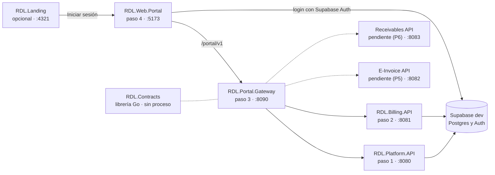

# Guía para levantar RDL PYMES en local

Actualizada el 2026-09-27. Versión en línea: [Claude Docs](https://claude.ai/code/artifact/d5c509ee-9542-4b89-a2a7-d73b2d2ef4ae).

## Resumen

Se levantan cuatro procesos en este orden: Platform (:8080), Billing (:8081), el Portal Gateway (:8090) y el portal
web (:5173). La landing (:4321) es opcional y no depende de nada. RDL.Contracts no se ejecuta: es la librería que
compilan los servicios Go.



El portal nunca llama a las APIs directo: todo pasa por el gateway, que reenvía el token del usuario. E-Invoice y
Receivables todavía no existen; el gateway las tiene declaradas y responde 503 en sus rutas.

1. **Platform primero**: el gateway lo marca como dependencia crítica en `/readyz` y es quien resuelve usuario,
   organización y roles.
2. **Billing**: necesita la membresía en `core`, que Platform ya dejó en la base.
3. **Portal Gateway**: al arrancar lee las URL de las dos APIs; si no responden, sus rutas dan 502/503.
4. **Portal web**: en modo `mock` no necesita nada de lo anterior; en modo `gateway`, sí.
5. **Landing**: independiente; su botón «Iniciar sesión» lleva al portal.

## Requisitos

Los repositorios deben estar uno al lado del otro en la misma carpeta (`RDL-PYMES/`): los `go.mod` apuntan a
`../RDL.Contracts` con `replace`.

| Herramienta | Versión | Para qué |
| --- | --- | --- |
| Go | 1.27.1 | Platform, Billing, el gateway y Contracts |
| Node | 22 o superior (probado con 24) | Portal y landing |
| golangci-lint | 2.x | Lint de los servicios Go (opcional para levantar) |
| sqlc | 1.31.1 | Solo si cambia las consultas SQL de Platform o Billing |
| gcc (WinLibs o MSYS2) | cualquiera reciente | Solo para `go test -race` |
| Python 3 | 3.12 | Solo para los scripts E2E de las APIs (`scripts/dev/e2e.sh`) |
| Git Bash | el que trae Git | Los comandos de esta guía son de bash |

Acceso: las APIs se conectan al proyecto Supabase de **dev** (`dzlsnsstuqpxvwegeqcy`) con sus propios roles de base.
Nunca se usa la `service_role` key ni producción. `make` no está instalado en Windows: esta guía da los comandos que
corre cada `Makefile`.

## Configuración

Cada proyecto trae un `.env.example`: se copia al archivo de la tabla y se completan solo los valores marcados.
Ninguno de esos archivos va a git.

| Proyecto | Archivo | Qué completar |
| --- | --- | --- |
| RDL.Platform.API | `.env` | `DB_POOLER_HOST` (Supabase → Connect → Session pooler; en dev es `aws-0-us-east-2.pooler.supabase.com`), `DB_PASSWORD` y `MIGRATE_DB_PASSWORD` de los roles `platform_api` y `platform_migrate` |
| RDL.Billing.API | `.env` | El mismo `DB_POOLER_HOST`, y las contraseñas de `billing_api` y `billing_migrate` |
| RDL.Portal.Gateway | `.env` | Nada: `PLATFORM_API_URL` y `BILLING_API_URL` ya apuntan a localhost. `FISCAL_API_URL` y `RECEIVABLES_API_URL` quedan vacías |
| RDL.Web.Portal | `.env.development.local` (o `.env.local`) | `VITE_DATA_SOURCE` (`mock` o `gateway`) y, para `gateway`, `VITE_SUPABASE_PUBLISHABLE_KEY` |
| RDL.Landing | `.env` | Nada para probar: los valores de ejemplo son de prueba |

Para las pruebas E2E, Platform, Billing y el gateway leen además `.e2e.local` con `E2E_EMAIL`, `E2E_PASSWORD`,
`E2E_EMAIL2` y `E2E_PASSWORD2`: los dos usuarios de prueba de Supabase dev.

Las contraseñas van entre comillas simples en el `.env`. `make` no las interpreta: antes de cualquier comando se
cargan con `set -a; . ./.env; set +a`.

## Paso a paso

Cada servicio va en su propia terminal de Git Bash y queda corriendo. Los comandos parten de la carpeta `RDL-PYMES/`.

### 0 · RDL.Contracts (no se levanta)

Es una librería: no tiene proceso. Solo tiene que estar en `RDL-PYMES/RDL.Contracts`. Para comprobar que está sana:

```bash
cd RDL.Contracts
go run ./cmd/contractsctl lint
```

### 1 · RDL.Platform.API (:8080)

```bash
cd RDL.Platform.API
set -a; . ./.env; set +a
go run ./cmd/migrate status   # la primera vez, o tras un cambio de migraciones
go run ./cmd/api
```

Listo cuando el log dice `platform-api escuchando` en `:8080`. Si `migrate status` muestra migraciones pendientes, se
aplican con `go run ./cmd/migrate up`, solo en dev.

### 2 · RDL.Billing.API (:8081)

```bash
cd RDL.Billing.API
set -a; . ./.env; set +a
go run ./cmd/migrate status
go run ./cmd/api
```

Listo cuando el log dice `billing-api escuchando` en `:8081`.

### 3 · RDL.Portal.Gateway (:8090)

```bash
cd RDL.Portal.Gateway
set -a; . ./.env; set +a
go run ./cmd/gateway
```

El binario es `./cmd/gateway`, no `./cmd/api`. Sin base de datos: no tiene migraciones. `go run ./cmd/gateway -routes`
imprime las 56 rutas que expone.

### 4 · RDL.Web.Portal (:5173)

```bash
cd RDL.Web.Portal
npm install          # la primera vez
npm run dev
```

Abra `http://localhost:5173`.

- Con `VITE_DATA_SOURCE=mock` funciona solo, sin APIs: datos simulados y la barra de revisión (el botón morado abajo).
- Con `VITE_DATA_SOURCE=gateway` necesita los pasos 1 a 3 y se ingresa con un usuario de Supabase dev.
- Para probar el build de producción: `npm run build` y `npm run preview`.

### 5 · RDL.Landing (:4321, opcional)

```bash
cd RDL.Landing
npm install          # la primera vez
npm run dev
```

Abra `http://localhost:4321`. «Iniciar sesión» lleva a `PUBLIC_PORTAL_URL` (el portal en :5173).

## Verificar que todo quedó arriba

Las tres APIs responden 200 en `/healthz` cuando están listas:

```bash
for p in 8080 8081 8090; do echo "$p: $(curl -s -o /dev/null -w '%{http_code}' localhost:$p/healthz)"; done
```

`/readyz` va más lejos: la de Platform y Billing revisa la base; la del gateway revisa Platform, Billing y el JWKS de
Supabase, y marca E-Invoice y Receivables como no configuradas sin fallar.

De punta a punta, con el portal en modo `gateway`: ingrese en `http://localhost:5173` con un usuario de prueba. Debe
ver Inicio con lo facturado en el mes. «Saldo por cobrar» y «Rechazados o en contingencia» salen como no disponibles:
es lo esperado mientras Receivables y E-Invoice no existan.

| Proyecto | Pruebas rápidas | Contra la base de dev |
| --- | --- | --- |
| RDL.Contracts | `go test ./...` y `go run ./cmd/contractsctl validate` | — |
| RDL.Platform.API | `go vet ./... && go test -race -count=1 ./...` | `go test -count=1 -tags=integration ./tests/isolation/...` y `bash scripts/dev/e2e.sh` |
| RDL.Billing.API | lo mismo | lo de Platform, más `go test -count=1 -tags=integration ./internal/adapters/postgres/...` |
| RDL.Portal.Gateway | `go vet ./... && go test -race -count=1 ./...` | `bash scripts/dev/e2e.sh` (con Platform y Billing arriba) |
| RDL.Web.Portal | `npm run typecheck && npm run lint && npm test` | `npm run test:e2e` (usa datos simulados; no necesita las APIs) |
| RDL.Landing | `npm run lint && npm test` | `npm run test:e2e` |

Las pruebas que tocan la base se saltan con un aviso si no encuentran el `.env`; no fallan. La integración completa de
Billing pide `TEST_MEMBER_ORG` y `TEST_MEMBER_SUBJECT` (la organización y el usuario de los fixtures de aislamiento).

## Problemas conocidos en Windows

| Síntoma | Causa | Qué hacer |
| --- | --- | --- |
| `make: command not found` | `make` no está instalado | Correr el comando que aparece en el `Makefile` (los de esta guía) |
| La API no arranca: falta `DB_POOLER_HOST` o la contraseña | El `.env` no se cargó en esa terminal | `set -a; . ./.env; set +a` en la misma terminal, antes de `go run` |
| `stat ...\cmd\api: directory not found` en el gateway | Su binario es otro | `go run ./cmd/gateway` |
| `Python was not found` en `scripts/dev/e2e.sh` | El alias de la Microsoft Store tapa a Python | Desactivar el alias en Configuración → Aplicaciones → Alias de ejecución, o poner `%LOCALAPPDATA%\Programs\Python\Python312` primero en el `PATH` con un `python3` que lo llame |
| `golangci-lint` o `sqlc` no se encuentran | Se instalan en `%USERPROFILE%\go\bin`, fuera del `PATH` | Agregarlo al `PATH` o llamarlos por ruta completa |
| `go.exe` bloqueado al compilar | Smart App Control | Ya está apagado en esta máquina; en otra, apagarlo |
| `golangci-lint`, Prettier o `contractsctl validate` marcan archivos sin cambios | El checkout dejó los archivos en CRLF (`core.autocrlf=true`) | Pendiente: un `.gitattributes` con `eol=lf`. Mientras, convertir a LF el archivo marcado |
| Una URL de Playwright sale como `C:/Program Files/Git/...` | Git Bash convierte las rutas que empiezan con `/` | `MSYS_NO_PATHCONV=1` antes del comando |
| El portal en modo `gateway` falla con CORS | El gateway no permite ese origen | `CORS_ALLOWED_ORIGINS=http://localhost:5173` (el valor por defecto); si usa otro puerto, agréguelo |

## Apagar y datos de prueba

Para apagar, `Ctrl C` en cada terminal. Si una terminal se cerró y el puerto sigue ocupado, en PowerShell:

```powershell
netstat -ano | Select-String ":8080 .*LISTENING"   # anote el PID de la última columna
Stop-Process -Id <PID>
```

Todo lo que se crea desde el portal o los E2E queda en Supabase **dev**, en las organizaciones de los usuarios de
prueba. Un documento emitido no se puede borrar (la base lo impide): se anula o se corrige con una nota. Las pruebas de
integración y aislamiento corren en transacciones que se revierten y no dejan datos.
