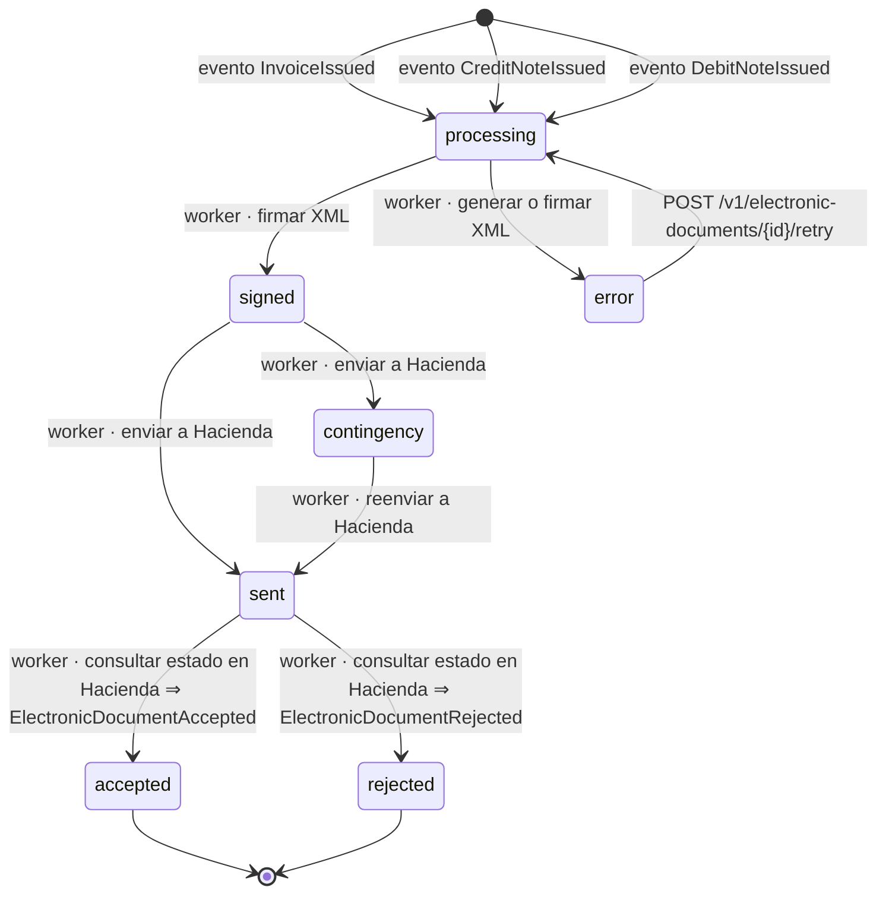

# Documento electrónico (fiscal)

- **Fuente:** [`state-machines/electronic-document.yaml`](../../state-machines/electronic-document.yaml) ·
  **Tabla:** `fiscal.electronic_documents.status`
- **Estados:** los 7 del `CHECK electronic_documents_status_ck` (decisión C3 del informe 0001).
- ⚠ **Las transiciones son una propuesta** para que el dueño de fiscal las confirme contra la especificación de
  Hacienda.

| Estado | Significado |
|---|---|
| `processing` | Creado a partir del evento de Billing; se arma el XML. |
| `signed` | XML generado y firmado con el certificado de la organización. |
| `sent` | Enviado a Hacienda; se espera o se consulta la respuesta. |
| `accepted` | Aceptado por Hacienda. Final. |
| `rejected` | Rechazado por Hacienda. Final para este documento: la corrección es otro documento. |
| `contingency` | Hacienda no disponible; se procesa según el procedimiento de contingencia y se reenvía. |
| `error` | Falla que impide continuar sin intervención (XML inválido, certificado vencido). |

## Transiciones

| De → a | Disparador | Emite |
|---|---|---|
| (nace) → `processing` | evento `InvoiceIssued`, `CreditNoteIssued` o `DebitNoteIssued` | — |
| `processing` → `signed` | worker: firmar XML | — |
| `processing` → `error` | worker: generar o firmar XML | — |
| `signed` → `sent` | worker: enviar a Hacienda | — |
| `signed` → `contingency` | worker: Hacienda no disponible | — |
| `contingency` → `sent` | worker: reenviar | — |
| `sent` → `accepted` | worker: consultar estado | `ElectronicDocumentAccepted` |
| `sent` → `rejected` | worker: consultar estado | `ElectronicDocumentRejected` |
| `error` → `processing` | `POST /v1/electronic-documents/{id}/retry` | — |

Reprocesar un evento de Billing no crea otro documento: fiscal deduplica por `eventId` (criterio de aceptación 3).
Los intentos y respuestas quedan en `fiscal.submission_attempts`.

## TODOs

- `TODO(fiscal)`: confirmar todas las transiciones con la especificación de Hacienda (C3).
- ¿Un documento que pasa mucho tiempo en `error` o `contingency` emite algún evento? Hoy no hay ninguno en el catálogo.
