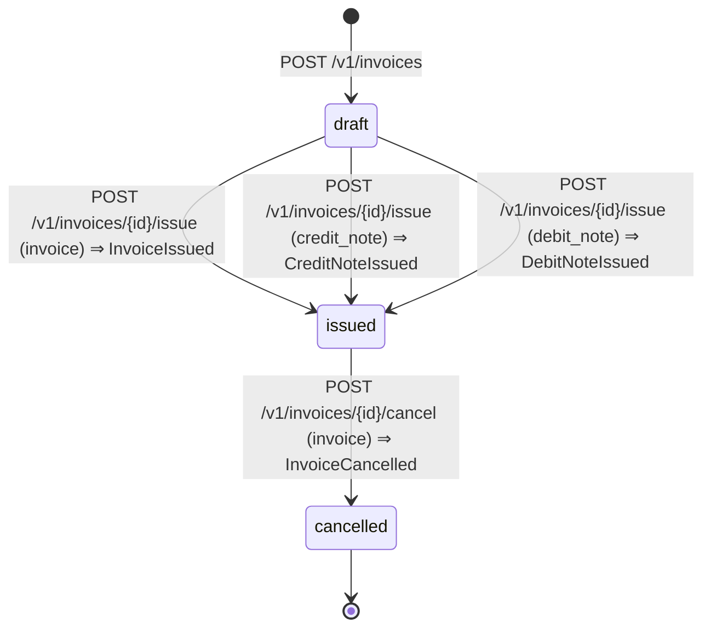

# Factura y notas (Billing)

- **Fuente:** [`state-machines/invoice.yaml`](../../state-machines/invoice.yaml) · **Tabla:** `billing.invoices.status`
- **Aplica a:** `invoice`, `credit_note` y `debit_note` (misma tabla, distinta `document_type`).
- **Estados:** los del `CHECK invoices_status_ck`.

| Estado | Significado |
|---|---|
| `draft` | Borrador editable, sin número visible ni snapshots. Se puede descartar (se borra la fila). |
| `issued` | Emitido: número, snapshots y montos fijos. **Nunca se edita** (arquitectura 7.4); se corrige con notas o anulación. |
| `cancelled` | Anulado con motivo obligatorio. Final. |

## Transiciones

| De → a | Disparador | Tipos | Emite | Requiere |
|---|---|---|---|---|
| (nace) → `draft` | `POST /v1/invoices` | todos | — | — |
| `draft` → `issued` | `POST /v1/invoices/{id}/issue` | `invoice` | `InvoiceIssued` | cliente activo, ≥ 1 línea, totales consistentes, número visible |
| `draft` → `issued` | ídem | `credit_note` | `CreditNoteIssued` | factura referenciada emitida, motivo |
| `draft` → `issued` | ídem | `debit_note` | `DebitNoteIssued` | factura referenciada emitida, motivo, vencimiento |
| `issued` → `cancelled` | `POST /v1/invoices/{id}/cancel` | `invoice` | `InvoiceCancelled` | motivo |

La emisión es independiente del estado fiscal: una factura `issued` puede tener su documento electrónico en
`processing`, `accepted` o `rejected` (arquitectura 6.1).

## Marca `requires_correction`

No es un estado. La pone `ElectronicDocumentRejected` junto con `fiscal_rejection_reason`; el documento sigue
`issued` y el usuario lo corrige con una nota o una anulación.

## TODOs

- `TODO(fiscal)`: ¿se pueden anular notas de crédito o débito? El catálogo no tiene evento para eso.
- ¿Cuándo se limpia `requires_correction`? Se propone: al emitir la nota que corrige.
