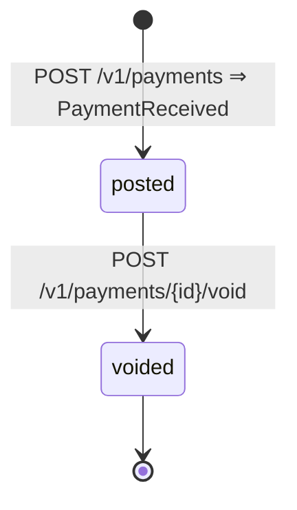

# Pago (Receivables)

- **Fuente:** [`state-machines/payment.yaml`](../../state-machines/payment.yaml) · **Tabla:** `receivables.payments.status`
- **Estados:** los del `CHECK payments_status_ck`.

| Estado | Significado |
|---|---|
| `posted` | Pago registrado; se aplica a una o varias cuentas por cobrar, total o parcialmente. |
| `voided` | Pago anulado con motivo; sus aplicaciones se revierten. Final. |

## Transiciones

| De → a | Disparador | Emite | Requiere |
|---|---|---|---|
| (nace) → `posted` | `POST /v1/payments` | `PaymentReceived` | — |
| `posted` → `voided` | `POST /v1/payments/{id}/void` | — | motivo; revertir las aplicaciones vigentes |

## TODOs

- El catálogo no tiene evento de pago anulado: el BFF y reportes no se enteran por eventos.
