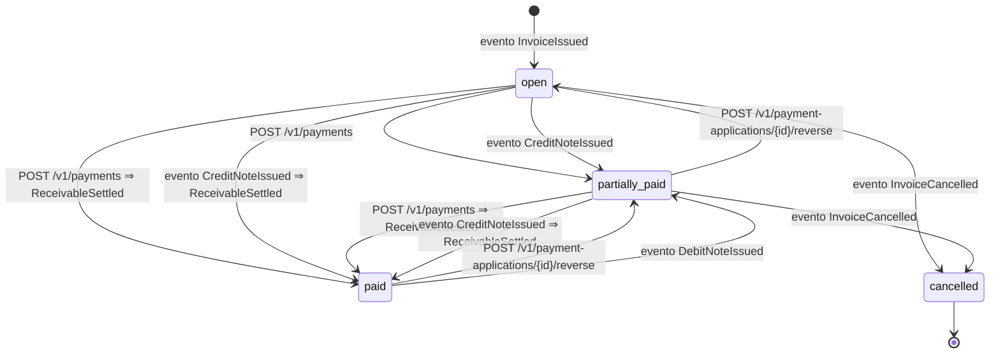

# Cuenta por cobrar (Receivables)

- **Fuente:** [`state-machines/receivable.yaml`](../../state-machines/receivable.yaml) ·
  **Tabla:** `receivables.receivables.status`
- **Estados:** los del `CHECK receivables_status_ck`.
- El estado se **deriva del saldo** (`balance_amount`): `open` si el saldo es el total adeudado, `partially_paid` si
  está entre cero y el total, `paid` si es cero.

| Estado | Significado |
|---|---|
| `open` | Saldo igual al total adeudado (monto original más notas de débito). |
| `partially_paid` | Saldo mayor que cero y menor que el total. |
| `paid` | Saldo cero (`settled_at`). Se reabre si se revierte una aplicación o llega una nota de débito. |
| `cancelled` | La factura se anuló. Final. |

## Transiciones

| De → a | Disparador | Emite |
|---|---|---|
| (nace) → `open` | evento `InvoiceIssued` | — |
| `open` → `partially_paid` | aplicación de pago o nota de crédito menor que el saldo | — |
| `open` / `partially_paid` → `paid` | aplicación de pago o nota de crédito igual al saldo | `ReceivableSettled` |
| `partially_paid` → `open` | reverso de aplicación que devuelve el saldo al total | — |
| `paid` → `partially_paid` | reverso de aplicación, o evento `DebitNoteIssued` | — |
| `open` / `partially_paid` → `cancelled` | evento `InvoiceCancelled` | — |

Reglas que no dependen del estado: un pago se aplica a varias cuentas y una cuenta recibe varios pagos; la suma de
aplicaciones nunca supera el pago; los reversos exigen motivo.

## TODOs

- Castigo (`write_off`): ¿deja la cuenta en `paid` o en `cancelled`? La base lo admite como ajuste, sin estado propio.
- Nota de débito sobre una cuenta `paid`: se propone reabrirla (así está modelado), en lugar de crear otra cuenta.
- Anulación de una factura ya pagada (`paid` → ?) y qué pasa con lo aplicado en `partially_paid` → `cancelled`.
