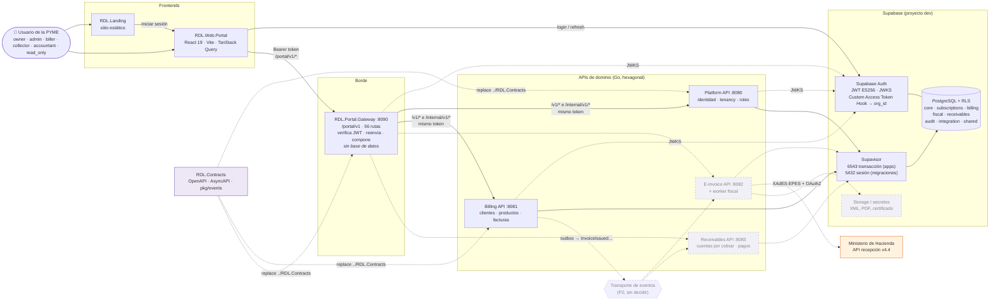
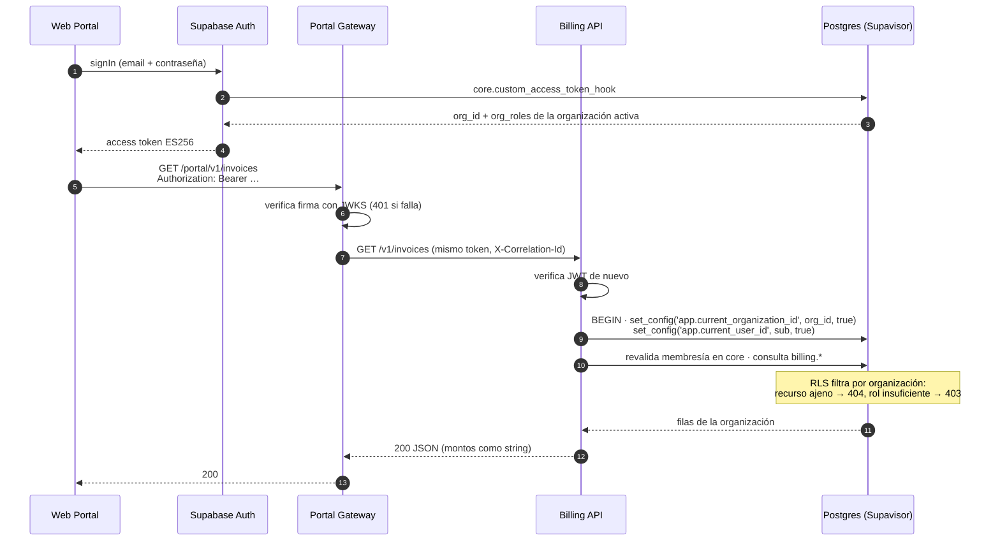
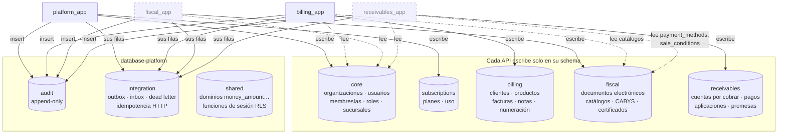
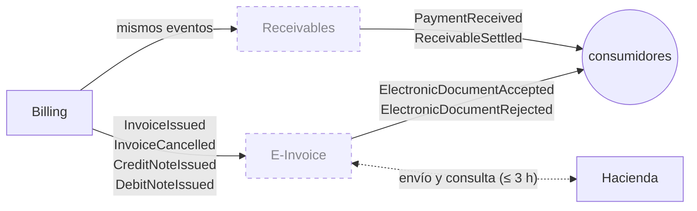

# RDL PYMES

SaaS B2B multiempresa de **facturación electrónica y cobranza para PYMES de Costa Rica** (comprobantes v4.4 de
Hacienda). Este repositorio agrupa varios **repositorios lógicos independientes**; cada uno se publica por separado
y tiene su propio `README.md`, `CLAUDE.md` y `docs/ESTADO.md`.

> Estado al día: [`docs/CHECKPOINTS.md`](docs/CHECKPOINTS.md). Reglas de trabajo: [`CLAUDE.md`](CLAUDE.md).

## Componentes

| Repo | Tipo | Puerto | Dueño de | Estado |
|---|---|---|---|---|
| [`RDL.Contracts`](RDL.Contracts) | Contratos (Go) | — | Glosario, OpenAPI, AsyncAPI, JSON Schema, máquinas de estado, ownership, errores | ✅ v0.2.0 |
| [`RDL.Platform.API`](RDL.Platform.API) | API de dominio (Go) | `:8080` | schemas `core` y `subscriptions` (identidad, tenancy, roles) | ✅ |
| [`RDL.Billing.API`](RDL.Billing.API) | API de dominio (Go) | `:8081` | schema `billing` (clientes, productos, facturas, numeración) | ✅ F2–F3 |
| `RDL.EInvoice.API` | API de dominio + worker (Go) | `:8082` | schema `fiscal` (XML, firma, envío a Hacienda) | ⬜ bloqueada por Hacienda |
| `RDL.Receivables.API` | API de dominio (Go) | `:8083` | schema `receivables` (saldos, pagos, cobranza) | ⬜ |
| [`RDL.Portal.Gateway`](RDL.Portal.Gateway) | BFF (Go), **sin base** | `:8090` | Nada: verifica, reenvía y compone | 🟡 |
| [`RDL.Web.Portal`](RDL.Web.Portal) | SPA React 19 | `:5173` | Nada: consume solo `/portal/v1` | 🟡 |
| [`RDL.Landing`](RDL.Landing) | Sitio estático (Astro) | `:4321` | Nada: marketing y enlace al portal | 🟡 lista con datos de prueba |

## Vista general

Las líneas punteadas son componentes que todavía no existen o decisiones abiertas.



**Reglas de la frontera**

- El navegador **solo** habla con Supabase Auth (iniciar sesión y refrescar) y con el Portal Gateway. Nunca con
  una API de dominio ni con la base.
- El gateway reenvía **el token del usuario** tal cual; nunca un token de servicio. No revalida membresías ni
  escribe en ningún schema: eso lo hace cada API dueña.
- Las APIs de dominio **no se llaman entre sí**. Se enteran de lo que hace otra por **eventos** (outbox) y leen
  schemas ajenos solo donde `ownership.yaml` lo autoriza (p. ej. Billing lee `core` y los catálogos de `fiscal`).
- Una API caída no tumba la pantalla: la vista compuesta marca la parte faltante como `unavailable`.

## Identidad y tenancy

La organización sale **solo** del `org_id` del JWT verificado más la membresía revalidada en la base; nunca de un
body, query, header ni URL.



Cambiar de organización es `PUT /portal/v1/me/active-organization` → Platform → refresco del token para que el
hook emita el `org_id` nuevo.

## Base de datos (una sola instancia, schemas por dueño)



- Cada servicio tiene un rol de aplicación (`*_app`, vía login `*_api` por Supavisor en modo transacción) y uno de
  migración (`*_migrator`, en modo sesión). La matriz vive en
  [`RDL.Contracts/ownership/ownership.yaml`](RDL.Contracts/ownership/ownership.yaml) y la verifica
  `contractsctl validate`.
- Montos en `numeric` (dominios `shared.*`); viajan como texto por pgx (`QueryExecModeExec`) y como `string` en
  JSON. Prohibido `float` en todo el código.
- Migraciones con goose por servicio, historial en su propio schema, patrón expand → migrate → contract.

## Eventos

Entidad + fila de outbox en la **misma transacción**, validada contra su JSON Schema (`pkg/events`). Billing
responde 201 aunque E-Invoice esté caída.



Canales: `billing.invoice-issued.v1`, `fiscal.electronic-document-accepted.v1`, etc.
([`asyncapi.yaml`](RDL.Contracts/asyncapi/asyncapi.yaml)). El transporte que saca las filas del outbox todavía no
está decidido (bloqueo P2).

## Forma interna de cada servicio Go

```
cmd/api, cmd/migrate        binarios
internal/domain/<agregado>  reglas puras (sin SQL ni HTTP)
internal/app                casos de uso + puertos; TxManager.WithinTenantTx
internal/adapters/          http · postgres (sqlc) · auth (JWKS) · events (outbox)
internal/wiring             router y dependencias
internal/platform/          config · health · logger · telemetry (OTel)
tests/isolation             aislamiento entre organizaciones sobre el router real
```

El Portal Gateway usa la misma forma **sin** `postgres/`, `queries/`, `migrations/` ni `sqlc/`.

## Levantar en local

Requisitos: Go 1.27.1, `golangci-lint`, `sqlc`, Node ≥ 22. Los repos deben estar uno al lado del otro (los
`go.mod` usan `replace bitbucket.org/rdl/contracts => ../RDL.Contracts`).

```sh
cd RDL.Platform.API   && make run    # :8080
cd RDL.Billing.API    && make run    # :8081
cd RDL.Portal.Gateway && make run    # :8090
cd RDL.Web.Portal     && npm run dev # :5173
```

Cada módulo lee su `.env` (ver su `.env.example`) apuntando al proyecto Supabase de **dev**. Detalles, pruebas y
cadena de cierre en el `README.md` y el `CLAUDE.md` de cada uno.

## Más documentación

- [`docs/CHECKPOINTS.md`](docs/CHECKPOINTS.md) — tablero de estado y bloqueos.
- `docs/Arquitectura_SaaS_B2B_Facturacion_Electronica.docx` y `docs/Planning_Desarrollo_V1_SaaS_Facturacion.docx`.
- [`prompts/`](prompts) — especificación P0–P8c de cada repo, incluidos los que aún no existen.
- `<módulo>/docs/decisiones/` — ADRs de cada repo.
